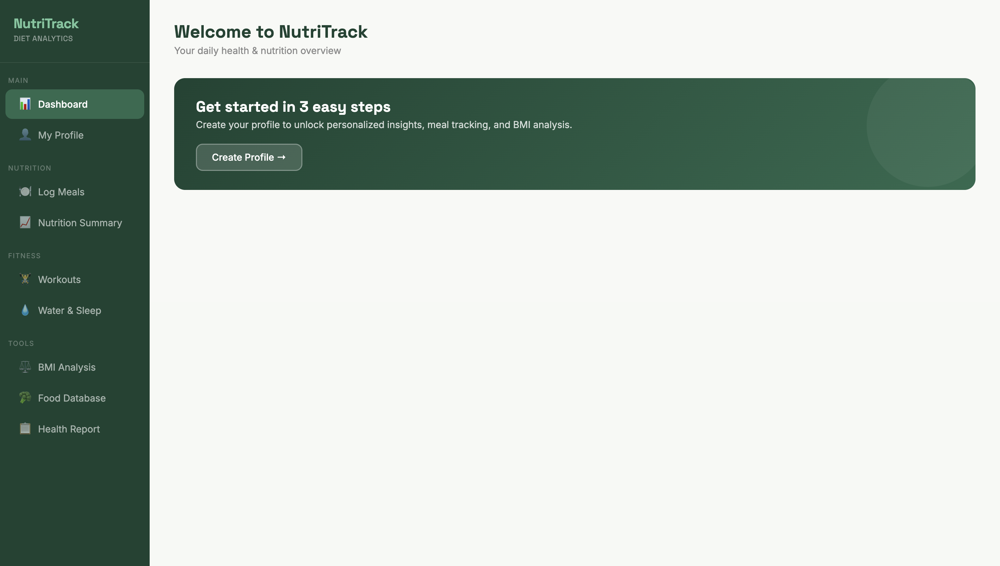
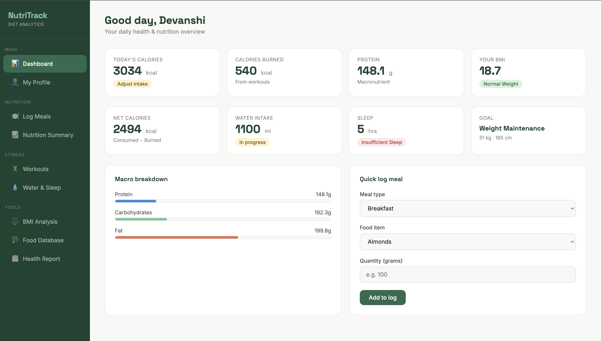
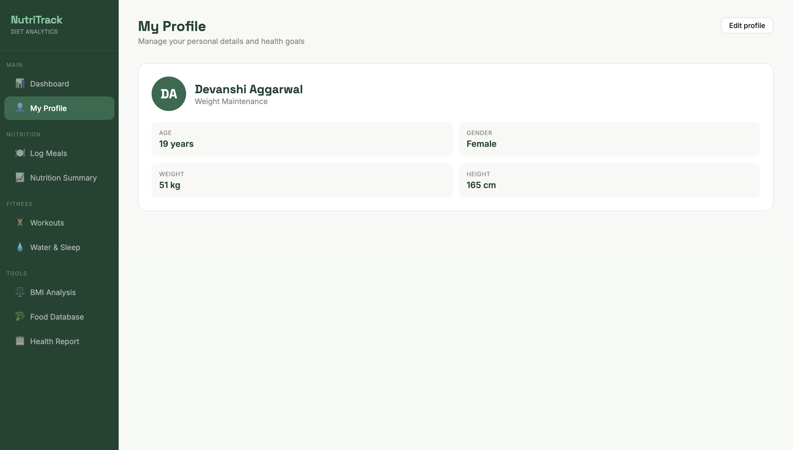
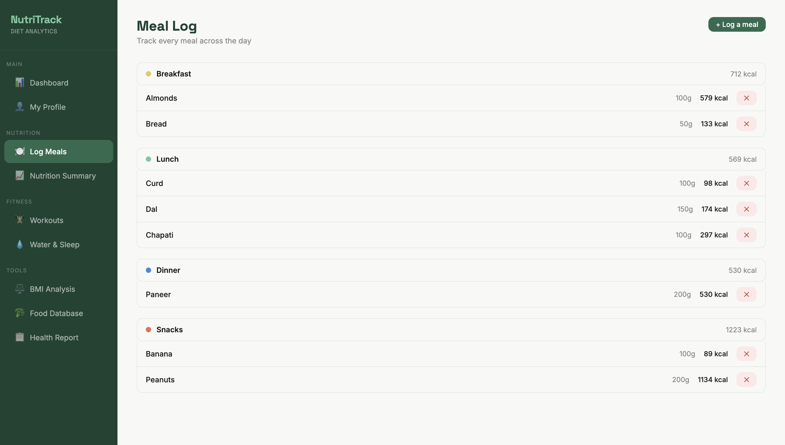
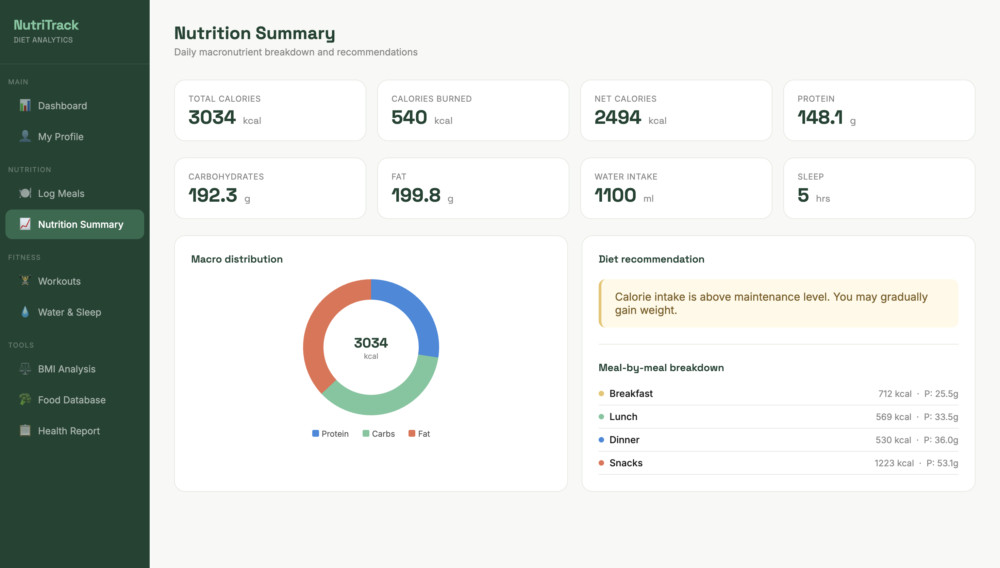
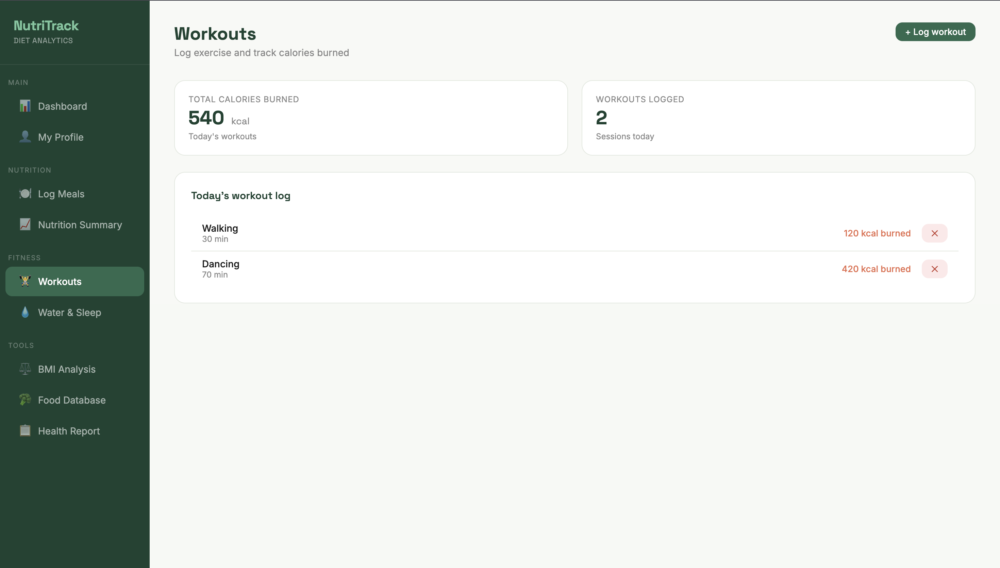
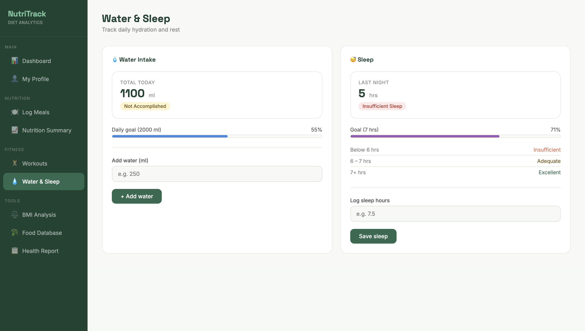
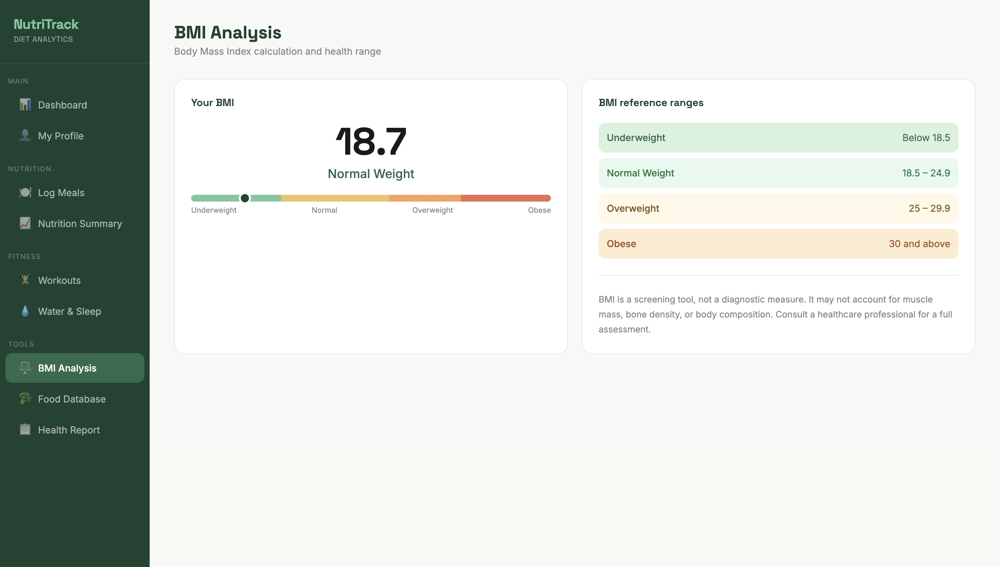
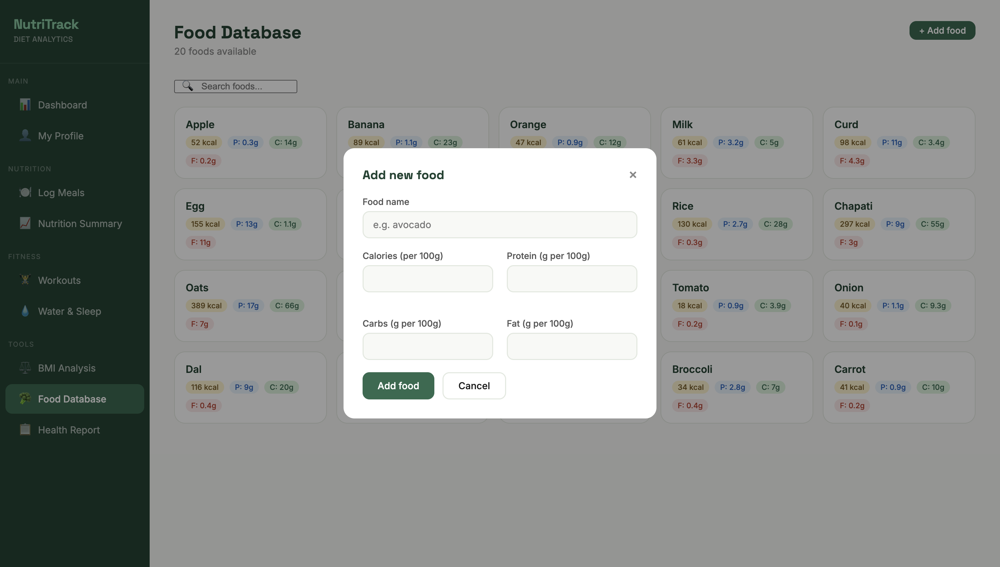
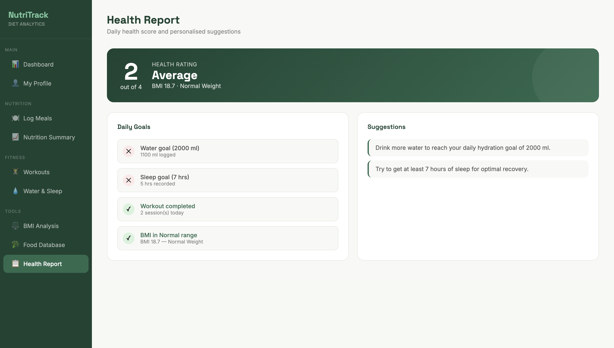

# NutriTrack - Health Management System

NutriTrack is a comprehensive health management system designed to help users monitor nutrition, fitness, hydration, sleep, and overall wellness in one place.

The core logic of this project-including health calculations, validations, data handling, and modular workflow-was implemented using **Python**.

To enhance project visualization and demonstrate a modern user experience, UI prototypes were designed separately using **HTML, CSS, and JavaScript with Claude AI assistance**. These prototypes represent how the application can be transformed into a full-scale web-based product.


---

# Features

* User profile creation and management
* BMI calculation and health category analysis
* Daily meal logging with calorie calculation
* Food database with nutritional values
* Nutrition summary with macronutrient breakdown
* Workout tracking with calories burned
* Water intake monitoring
* Sleep tracking and analysis
* Personalized health report and recommendations

---

# Tech Stack

* **Frontend / UI Prototype:** HTML5, CSS3, JavaScript
* **Core Logic:** Python
* **Architecture:** Modular multi-file design
* **AI Assistance:** Claude AI (UI generation)
* **Version Control:** Git & GitHub

---

# Project Structure

```bash
NutriTrack-Health-Management-System/
│
├── README.md
├── main.py
├── calculations.py
├── validation.py
├── food_database.py
├── fitness_database.py
│
└── screenshots/
    ├── welcome.png
    ├── dashboard.png
    ├── profile.png
    ├── meal_log.png
    ├── nutrition_summary.png
    ├── workouts.png
    ├── water_sleep.png
    ├── bmi_analysis.png
    ├── food_database.png
    └── health_report.png
```

---

# Modules Overview

### `main.py`

Acts as the central controller of the project and connects all modules together.

### `validation.py`

Handles all user input validation to ensure correct and safe data processing.

### `calculations.py`

Contains all mathematical and health-related calculations including:

* BMI
* Calorie needs
* Macronutrient calculations
* Health scoring

### `food_database.py`

Stores food items and their nutritional values such as:

* Calories
* Protein
* Carbohydrates
* Fats

### `fitness_database.py`

Stores workout activities and calories burned for each exercise.

---

# Application Screenshots

## Welcome Screen

Initial screen shown before profile setup.



---

## Dashboard

Main dashboard showing daily health overview.



---

## Profile Page

Displays personal health information and goals.



---

## Meal Log

Track meals throughout the day with calorie monitoring.



---

## Nutrition Summary

Shows macro distribution and diet recommendations.



---

## Workouts

Track exercises and calories burned.



---

## Water & Sleep Tracker

Monitor hydration and sleep quality.



---

## BMI Analysis

Visual BMI indicator with health ranges.



---

## Food Database

Browse available food items and nutrition values.



---

## Health Report

Personalized health score and suggestions.



---

# Key Learnings

Through this project, I improved my understanding of:

* Modular Python programming
* Function-based architecture
* Data organization and management
* Input validation techniques
* Health metric calculations
* UI/UX design thinking
* AI-assisted development workflow
* GitHub project structuring

---

# Future Improvements

Potential future enhancements include:

* Database integration (SQLite / MySQL)
* Authentication system
* Cloud deployment
* Historical data analytics
* Weekly/monthly reports
* AI-powered diet recommendations
* Mobile responsive interface

---

# Author

**Devanshi Aggarwal**
B.Tech CSE Student | VIT Bhopal
Passionate about Python, AI, and building impactful software solutions.

GitHub: https://github.com/Devanshi-Aggarwal
